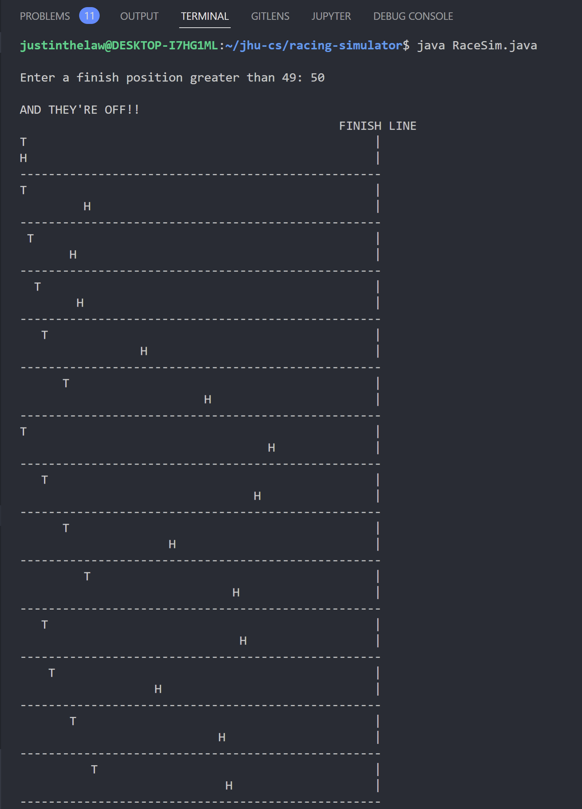
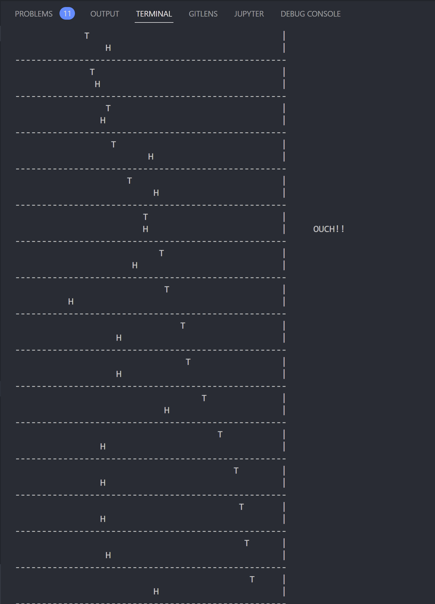

# Tortoise vs. Hare Racing Simulator

This is project #1 of JHU's Programming in Java class (module 03 - 05), in partial fulfillment of the M.S. in Computer Science program. This project involves writing a program to simulate a tortoise and hare race.

## Program Specification

The contenders will each race along a horizontal course that contains at least 50 positions. You may add more if you wish. The race begins with each contender at position 1. The contender that first reaches or passes the last position of the course is the winner of the race.

The following table indicates the types of moves that each contender can make.

### Contender Type of Move Percentage of Time Result of Move

For each move for each contender, generate a random integer, n, in the range 1 ≤ n ≤ 10.

| Contender | Type of Move | Percentage of Time | X ≤ n ≤ 10 | Result of Move  |
| :-------- | :----------- | :----------------- | :--------- | --------------- |
| Tortoise  | Fast plod    | 50%                | X = 1-5    | 3 squares right |
|           | Slow plod    | 30%                | X = 6-8    | 1 squares right |
|           | Slip         | 20%                | X = 9-10   | 6 squares left  |
|           |              |                    |            |                 |
| Hare      | Big hop      | 20%                | X = 1-2    | 9 squares right |
|           | Small hop    | 30%                | X = 3-5    | 1 squares right |
|           | Big slip     | 10%                | X = 6      | 12 squares left |
|           | Small slip   | 20%                | X = 7-8    | 2 squares left  |
|           | Fall asleep  | 20%                | X = 9-10   | 0 squares       |

Each contender starts at position 1. When a contender slips, they can’t slip any further left than Position 1. You will use a random number generator to simulate the percentages of each type of move indicated in the table. To generate random numbers, you can research the built-in Java random number method that is part of the Math class.

There are a number of ways to design this program. One way would be to have a looping construct be the overall controller of things. Each iteration would adjust the contender positions, and the loop would terminate when one of the contenders reaches the last square of the race course. You will decide on an approach as part of your design step.

You must keep track of each contender’s position and display it each time positions change. Show the letter “T” in the position of the tortoise, and the letter “H” in the position of the Hare. Upon moving, it is possible for the contenders to land on the same square. When this happens, the tortoise bites the hare, and your program should display “OUCH!!” beginning at that square. All output positions other than the “T”, the “H”, and the “OUCH!!” should be blank.

### Pre-set Race Messages

If the tortoise wins, display “TORTOISE WINS!!”. If the hare wins, display “HARE WINS!!”. If the race is a tie, display “IT’S A TIE!!”. At the beginning of the race, display “AND THEY’RE OFF!!”.

### Example Output

## Program Design

### Thought Process

#### Diagram

No diagram was produced due to a lack of complexity in the interfaces and producer-consumer relationships within this assignment.

#### Discussion

1. General program design. How is the program organized?
   The program is organized using the table of methods below. The methods were broken based on the functions related to the user input, intialization of the race, movement of the hare and tortoise, and random number/change generation. Constant variables (Strings and ints) are placed at the top of the RaceSim class, based on the [Contender Type of Move Percentage of Time Result of Move](#Contender-Type-of-Move-Percentage-of-Time-Result-of-Move) table and [Pre-Set Race Messages](Pre-Set-Race-Messages) in order to allow future programmers to adjust certain simulation settings without needing to dive too deeply into the methods. The methods consist of while-loops that run the race until a winner is identified, and for-loops that iterate upon the required spacing before the T and H characters in order to print their position to console.

2. What major data structures were used?
   The program uses `java.util.*` maps (dictionaries) and hash tables, to simplify the way in which an action is picked based on the random number/chance generation, and Scanners, to grab user input from the console. Besides Scanners, maps (dictionaries), and hash tables, Strings and ints are stored as constant variables at the top of the class, or as instance variables when needed for method-based/scoped functionality.

3. What alternative approaches were considered and why were they rejected?
   One major alternative approach would be to stuff all variables AND methods into one large main method. This would simplfy the coding for myself in this very moment; HOWEVER, this would make it difficult to change parameters and functions due to the lack of readability and modularity. By breaking out the functionality into methods and breaking down variables into method-scoped or class parameters, any other programmer will be able to modify small chunks of the code base without needing to manually refactor an entire monoloth.

   A second variation would be forgoing the usage of the Scanner and hard-coding the numbe rof positions. This would be the wrong way to go, as demonstration of the robustness of the program requires input of many different possible positions to check for bugs in the position-based manipulation and to provide interactivity to the end-user.

   A third variation was to integrate all race messages and constants into the individual methods themselves. This was not chosen so that future programmers can change these constants and messages without diving deeper into the codebase. In addition, anything printed to console or used as a race parameter should be immutable and only changeable through hard-coding again.

   A final variation would be not using the map data structure, and instead using many if-else statements to check for the action being performed. A map is not only easier to debug due to its key-value pair nature, but also easier to access and manipulate than a bunch of if-else statments. In addition, my usage of human-readable key-value pairs allows any programmer to modify the program parameters as needed. Although this may not be memory efficient, it is much mor readable for all programmers, including myself.

4. What did you learn from doing this project and what would you do differently?
  The biggest thing I learned from this project was the proper usage of map data structures in Java. Having used "objects" in JavaScript/TypeScript and "dictionaries" in Python, understanding key-value pair data sctructures is one of my priorities as this type of data structure is a pattern seen everywhere in porgramming. In addition, I learned a lot about oragnizing my program into smaller chunks, methods, that are easier to manage and debug than a large monoloth. Having done functional and OOP programming in JavaScript/TypeScript, Lua, and Python in the past, as well as functional programming in C, being able to translate some of those skills over to Java reinforced my thought process and concepts for future OOP programming.

  If I had to do this differently, I would add more classes that break apart methods even further. For example, if someone were to want to extend the functionality of the simulation to a full-up game, that may require breaking out the tortoise, hare, game board, etc. into classes that contain interfaces and public methods that can interact seamlessly, but also be broken apart in a modular fashion for de-bugging, modification, etc. Currently, my knowledge of Java programming in a more complex OOP environment is still a little bit low, which is why I chose to keep everything in the same class. In addition, I believe that the complexity of the current specification/problem does not require the extra effort of class break-downs.

#### Assumptions

- All methods are under one class, RaceSim
- The only user input required is the number of positions in the race
- The user input checking only requires that the user enters a whole integer of greater than or equal to 50
- Positions being printed to console must:
  - Be a new line (line return/erasure not allowed)
  - Consist of T on the line above and H on the line below, tortoise and hare respectively

### Implementation Code

The program was written in VSCode on WSL 2, Ubuntu 20.04.4 LTS. Please refer to [RaceSim.java](./RaceSim.java) for code. Run `java RaceSim.java` in the root of the git repository to run the program.

#### Implementation Output

Below is an output in the VSCode Integrated Terminal.

